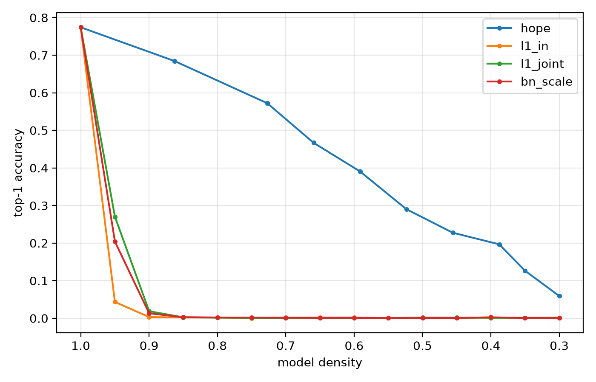
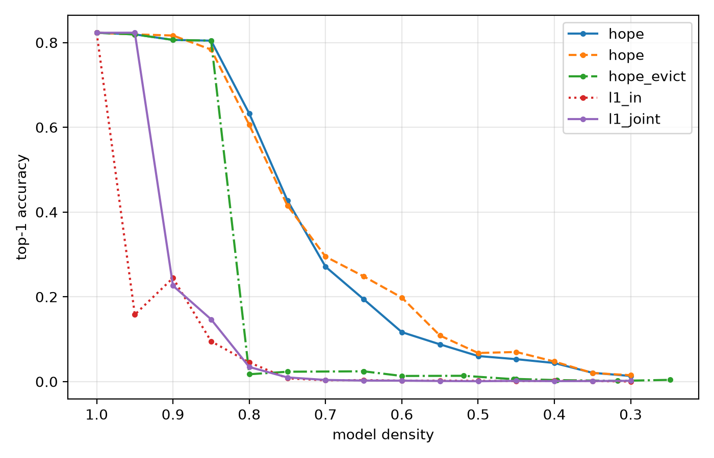

# hope-pytorch

PyTorch implementation of **HOPE: Hilbert Operator for Progressive Encoding** ([arXiv:2607.21366](https://arxiv.org/abs/2607.21366)), a data-free method for structured compression of trained networks. Implemented from the paper alone; equation numbers are cited throughout the source.

The paper covers ReLU with BatchNorm. This repo additionally supports GELU with LayerNorm and implements the paper's DEFT fine-tuning method. All results below use pretrained torchvision checkpoints.

- **ResNet-50 compression**: 68.4 percent ImageNet top-1 with 17.5 percent of parameters removed, without fine-tuning. Magnitude baselines drop to chance at the same density.
- **ViT-B/16 compression**: 80.4 percent top-1, from 82.3, with 15 percent of MLP hidden units removed. A 512 image calibration pass replaces BatchNorm statistics.
- **DEFT transfer**: highest H-Score on both targets, CIFAR-100 and SVHN. The frozen core is bitwise unchanged after fine-tuning.

## Install

```bash
git clone https://github.com/jakariaemon/hope-pytorch
cd hope-pytorch
pip install -e .
```

Python 3.10+. Pinned development versions in `requirements.txt`. Runs on CUDA, Apple Silicon, and CPU; the compression math is float64 NumPy on CPU, the GPU only accelerates evaluation.

## Usage

```bash
# ResNet-50 compression and baselines
python scripts/run_compress.py --data /path/to/imagenet/val --target-density 0.3 --audit
python scripts/run_compress.py --data /path/to/imagenet/val --method l1_in

# ViT-B/16: calibrate once, then compress
python scripts/calibrate_vit.py --data /path/to/imagenet/val --out vit_calib.npz
python scripts/run_compress_vit.py --data /path/to/imagenet/val --calib vit_calib.npz

# DEFT transfer, ImageNet source to SVHN target
python scripts/run_deft_vit.py --method deft --target svhn --percentile 20 \
  --calib vit_calib.npz --imagenet /path/to/imagenet/val
```

## Results

Evaluation uses a fixed 5000 image ImageNet val subset (seed 0). Full CSVs in `assets/`.

### ResNet-50 compression



| density | HOPE | L1 in | L1 joint | BN scale |
|---|---|---|---|---|
| 1.00 | 0.774 | 0.774 | 0.774 | 0.774 |
| 0.86 | 0.684 | 0.002 | 0.002 | 0.003 |
| 0.59 | 0.391 | 0.002 | 0.001 | 0.001 |
| 0.30 | 0.059 | 0.001 | 0.001 | 0.001 |

The magnitude baselines fall to chance after removing 5 to 10 percent of filters, consistent with the scale symmetry failure described in the paper. Exact and zero-bias kernels produce identical trajectories on these weights.

### ViT-B/16 compression (GELU + LayerNorm)



| density | HOPE | HOPE exact | L1 in | L1 joint |
|---|---|---|---|---|
| 1.00 | 0.823 | 0.823 | 0.823 | 0.823 |
| 0.90 | 0.806 | 0.817 | 0.244 | 0.226 |
| 0.85 | 0.804 | 0.783 | 0.095 | 0.147 |
| 0.80 | 0.632 | 0.606 | 0.045 | 0.034 |

Compression acts on the MLP hidden units, about two thirds of the parameters. The extension derives a closed-form GELU self-kernel, reduces the exact cross-kernel to a one dimensional integral, and replaces the eq (15) scale split with a 2D coefficient search, since that split requires positive homogeneity and GELU is not positively homogeneous.

### DEFT transfer (ImageNet source, 3 epochs)

Best H-Score, the harmonic mean of target accuracy and source retention:

| method | CIFAR-100 target | SVHN target |
|---|---|---|
| DEFT P=20 | **0.815** (0.861 / 0.774) | **0.848** (0.939 / 0.774) |
| head only | 0.809 (0.795 / 0.823) | 0.654 (0.542 / 0.823) |
| full FT | 0.727 (0.862 / 0.629) | 0.518 (0.946 / 0.357) |
| DEFT P=40 | 0.487 (0.869 / 0.338) | 0.498 (0.945 / 0.338) |

DEFT trains only the low capacity slack and a new head. On SVHN it matches the target accuracy of full fine-tuning while retaining 0.774 source accuracy against 0.357. The slack fraction P trades plasticity against retention; P=20 gives the highest H-Score on both targets.

## Layout

```
hope/
  surrogate.py    BN-derived Gaussian surrogate (Sec 4, eq 1)
  kernels.py      ReLU kernels, warped correlation (App E, eq 79-85)
  activations.py  GELU kernels and the activation registry
  calibrate.py    statistics pass for LayerNorm models (App E)
  capacity.py     neuron and layer capacity (eq 75)
  parent.py       parent synthesis, BN recovery, 2D search (Sec 7, App D)
  costs.py        prune, merge, evict costs and footprints (eq 6, 20, App B.2)
  cache.py        decoupled pair cache, slim mode for wide layers (App B.4)
  audit.py        Lemma C.3 path audit
  encoder.py      greedy loop (Sec 10, Algorithms 1-2)
  deft.py         DEFT partition, gradient gating, slack masking (Sec 11.2, Alg 3)
  adapters/       ResNet (Torch-Pruning) and ViT (direct surgery) executors
```

## Tests

```bash
pytest -q
```

Kernels are gated against 40M sample Monte Carlo at 0.1 percent; parent deployment is exact through a real BatchNorm; cache scalars match direct synthesis; DEFT's frozen core is asserted bitwise on the real ViT. Slow tests need `HOPE_IMAGENET_DIR` and `HOPE_VIT_CALIB` set and skip otherwise.

## Notes and limitations

- The Gaussian surrogate carries measurable error on real activations: median 18.5 percent per channel on ResNet-50 (Test D). Decisions depend on cost rankings rather than absolute values.
- The zero-bias cross-kernel degrades with bias: 7 percent normalized error at |beta/gamma| 0.25, 48 percent at 1.5. ViT units are substantially more biased than ResNet filters. A full exact-kernel sweep on ViT produced a different but comparable trajectory (crossing within 2 points in the usable region), so scan precision is not what limits the compression floor; every executed merge is repriced with exact kernels in both modes.
- Block eviction is unsound on pre-norm transformers and off by default for ViT: one eviction collapsed accuracy from 0.80 to 0.03, and the static footprint of App B.2 overprices eviction of already thinned blocks.
- All 2310 ViT merges satisfied the Lemma C.3 capacity bound; merges are rare on ResNet-50 (1 in 686 actions).
- DEFT numbers are single seed, and P was selected after observing the P=40 result. A multi-seed grid has not been run.
- DEFT's structural mask is a no-op on ViT (no direct slack-to-core weights across blocks); protection comes from exact freezing, and the shared fc2 bias must stay frozen or target drift leaks into the source path.

## Extending

The core is architecture agnostic; only adapters know model structure. A new architecture needs a `LayerSurrogate` per compressible layer, static footprints, and an executor with `prune`, `merge`, `evict`. Networks without BatchNorm need one calibration pass. ReLU and GELU kernels exist; other activations need their kernels derived or tabulated.

## License

MIT. If you use this code, cite the original paper (see `CITATION.cff`).
